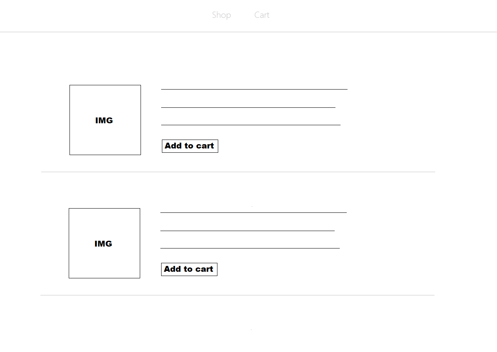
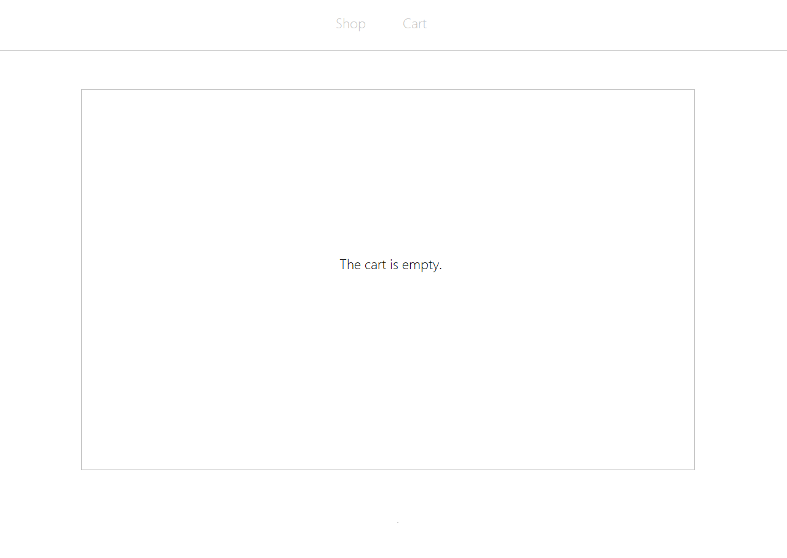
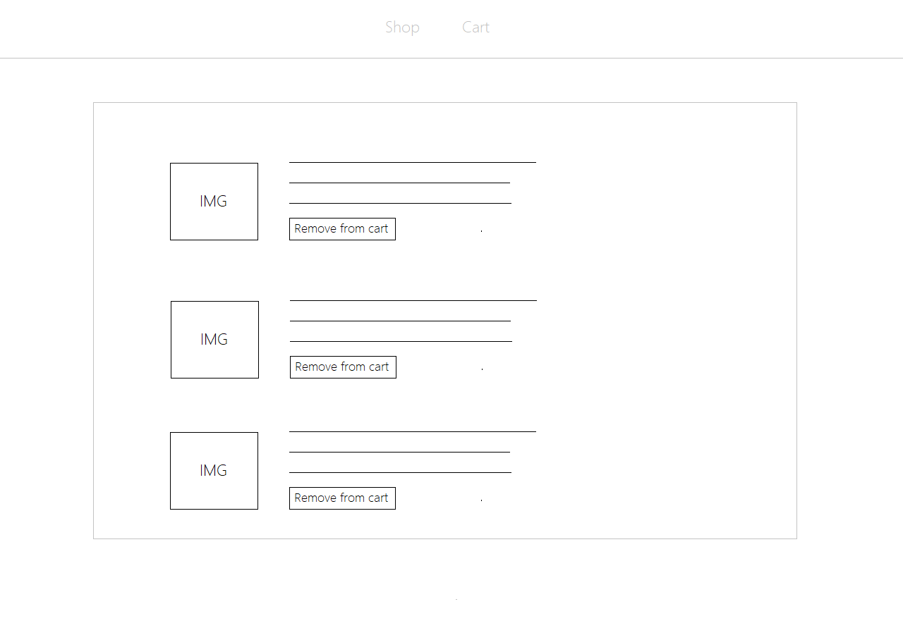

# Day 2

Estimated time is 3 hours.

## Learning Objectives

- DOM manipulation.
- Object oriented programming.
- local and session storage.

# Projects
- `Store`

# Content

- Today you are going to build a project. You will use everything that you've learned so far, and the following:
  - [Local & Session storage](https://www.youtube.com/watch?v=xSv-9Yod83Q) in JavaScript.
  - Why Is [Array/Object Destructuring](https://www.youtube.com/watch?v=NIq3qLaHCIs) So Useful And How To Use It

# Project Instructions

- The website you'll build has a `Shop` & `Cart` page. `Shop` with all the products (You Decide) with a `add to cart` button.
  The `Cart` page lists all the products that has been added to the cart with a `Remove from cart` button that removes the product from the cart.
- If the product is added to the cart it should remain on the cart if the user refreshes the page and vise-versa. Hint* `localstorage`
- Use webpacks.
- The website will be a Single Page Application.
- Product's data should be stored inside of an array, inside objects.
  Example
  ```
  products = [
    {
      name: 'item1',
      etc...
    },
    {
      name: 'item2',
      etc...
    },
  ]
  ```
- Try to make use of destructuring method to get data from the objects.
- Each logic should be in its serperate module. For this project, more is better.
- The design should be amazing. I mean stick to the given layout, but make the design great and dynamic. Use hovers, transitions, animations. Whatever you can! Work on design at the end.
- When done, you will create a pull request from a seperate branch and wait for my approval.

# Store Layout
<p align="center">



The font is YaHei, if you want to use it.
</p>

***Note Make sure you use `.gitignore` and do not commit `node_modules`**
